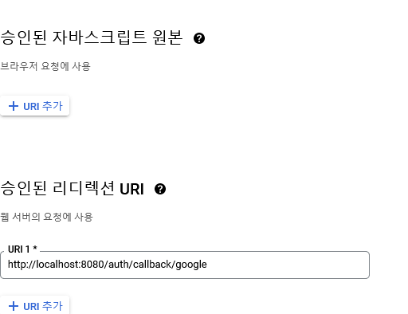

```bash
  $ docker pull redis
```

```bash
  $ docker run --name <container name> -d -p 16379:6379 redis redis-server --requirepass "<password>" 
```



### backend
```bash
  $ go run main.go
```

### frontend
```bash
  $ go run frontend/client.go
```

[http://localhost:8080/index](http://localhost:8080/index)
